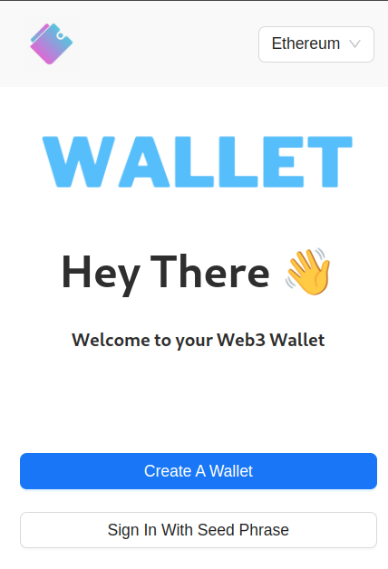
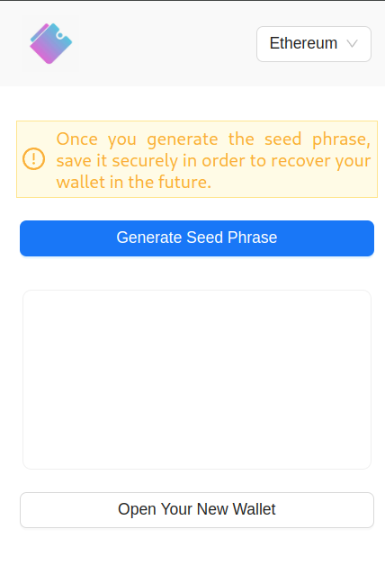

# 🦊 Crypto Wallet Browser Extension

A browser-based crypto wallet built using React and Moralis APIs. This extension allows users to manage wallets, view token and NFT holdings, and perform native token transfers.

<div align="center">
  <div>
    
    
  </div>

</div>

---

## 🚀 Features

### 🔐 Wallet Management

- **Create New Wallet** – Generate a new wallet with a unique seed phrase.
- **Import Existing Wallet** – Load an existing wallet using a seed phrase.

### 🪙 Token & NFT Dashboard

- **Token Balances** – View native and ERC-20 token balances.
- **NFT Gallery** – Display owned NFTs with metadata and images.

### 🔁 Transfers

- **Native Token Transfers** – Send native tokens to other addresses.

## 📦 Requirements

- [Node.js](https://nodejs.org/) and `npm`
- A free [Moralis](https://developers.moralis.com/) account

## 🛠️ Installation & Setup

> This is a monorepo with separate `frontend` and `backend` directories.

### 1. Clone the Repository

```bash
git clone https://github.com/ArunRawat404/crypto-wallet.git
cd crypto-wallet
```

### 2. Run backend

```bash
cd backend
npm install
```

Create a `.env` file in the backend/ directory and add your Moralis API key:

```
MORALIS_KEY=your_moralis_api_key
```

Start the backend server:

```bash
node index.js
```

### 3. Run Frontend

```bash
cd frontend
npm install
npm run start
```

Open your browser and navigate to:
👉 http://localhost:3000

⚙️ Transfer Configuration

To enable the transfer functionality, make sure to add the respective chain `rpcUrl` in the `chains.js` file.

## 📝 License

This project is licensed under the MIT License.
